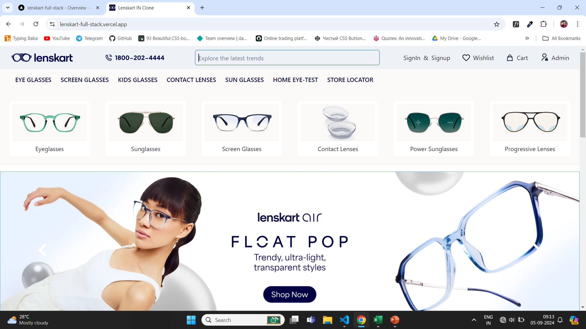
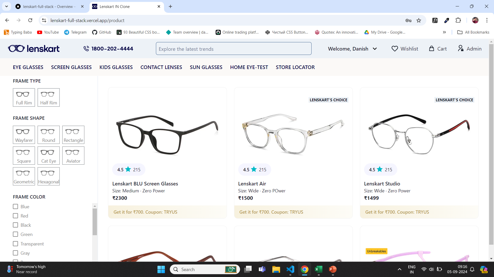
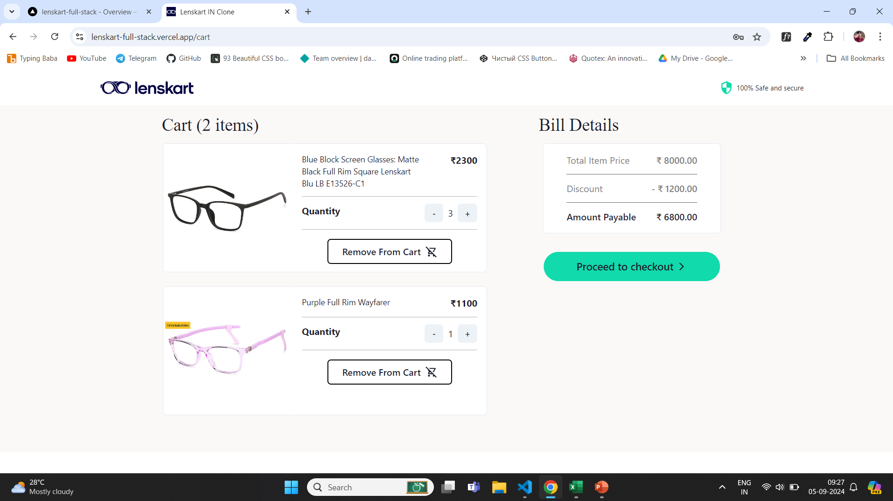

# 🕶️ Lenskart Full-Stack Clone

Welcome to the **Lenskart Full-Stack Clone** project, a comprehensive web application built using the MERN stack (MongoDB, Express.js, React+Vite, Node.js). This application is a clone of the popular eyewear e-commerce platform, Lenskart, featuring various functionalities like adding to wishlist, cart management, filtering, sorting, and an integrated payment system using Razorpay.

🌐 **Live Demo**: [Lenskart Clone on Vercel](https://lenskart-full-stack.vercel.app/)  
🖥️ **Backend API**: [Lenskart Backend on Render](https://lenskart-full-stack.onrender.com)

## 🚀 Features

- **🛒 Cart Management**: Add, remove, and update products in the cart.
- **❤️ Wishlist**: Save your favorite products to the wishlist.
- **🔍 Advanced Filtering & Sorting**: Filter products by categories, price, and more.
- **💳 Secure Payment Gateway**: Integrated with Razorpay for secure transactions.
- **📦 Product Management**: Full CRUD operations for managing products.
- **🔑 User Authentication**: Sign up, sign in, and secure sessions for users.
- **🛠️ Admin Panel**: Manage products, orders, and users efficiently.
- **📱 Mobile Responsive**: Fully responsive design for optimal user experience on mobile devices.

## 🛠️ Tech Stack

- **Frontend**: React + Vite, Chakra UI
- **Backend**: Node.js, Express.js
- **Database**: MongoDB
- **Payment Integration**: Razorpay
- **Deployment**: Vercel (Frontend), Render (Backend)

## ⚙️ Installation

To run this project locally, follow these steps:

1. **Clone the repository**:

   ```bash
   git clone https://github.com/yourusername/lenskart-full-stack.git
   cd lenskart-full-stack

2. **Install dependencies for both frontend and backend**:

   ```bash
   cd client
   npm install

   cd ../server
   npm install

3. **Set up environment variables**:

     &bull; Create a .env file in the server directory with the following:
   ```bash  
   PORT=your_port
   MONGO_URL=your_mongodb_url
   RAZORPAY_KEY_ID=your_razorpay_key_id
   RAZORPAY_KEY_SECRET=your_razorpay_key_secret

4. **Run the application**:

    &bull; Start the backend server:
   ```bash  
   cd server
   npm run server

&bull; Start the frontend developmeent server: 

    cd server
    npm run dev

## 📖 Usage

Once the application is set up, you can:

- **Browse Products**: Search, filter, and sort eyewear products.
- **Add to Wishlist**: Save products for later viewing.
- **Add to Cart**: Manage your cart and proceed to checkout.
- **Checkout**: Make secure payments through Razorpay.
- **Admin Controls**: For managing the store (add, edit, delete products).

## 📚 API Endpoints

The backend API is deployed at: [https://lenskart-full-stack.onrender.com](https://lenskart-full-stack.onrender.com)

### Authentication
- `POST /api/auth/register` - Register a new user
- `POST /api/auth/login` - Log in an existing user

### Products
- `GET /api/products` - Get all products
- `GET /api/products/:id` - Get a single product
- `POST /api/products` - Create a new product (Admin only)
- `PUT /api/products/:id` - Update a product (Admin only)
- `DELETE /api/products/:id` - Delete a product (Admin only)

### Cart
- `GET /api/cart` - Get user's cart items
- `POST /api/cart` - Add item to cart
- `PUT /api/cart/:id` - Update cart item
- `DELETE /api/cart/:id` - Remove item from cart

### Wishlist
- `GET /api/wishlist` - Get user's wishlist
- `POST /api/wishlist` - Add item to wishlist
- `DELETE /api/wishlist/:id` - Remove item from wishlist

### Payment
- `POST /api/payment/order` - Create a new order
- `POST /api/payment/verify` - Verify payment status

## 🤝 Contributing

We welcome contributions! Please read our Contributing Guidelines to get started.

1. **Fork the repository**.
2. **Create a new branch** (`git checkout -b feature-branch`).
3. **Make your changes**.
4. **Commit and push** (`git commit -m 'Add feature'` and `git push origin feature-branch`).
5. **Open a Pull Request**.

## 📸 Screenshots

### Home Page


### Product Page


### Cart Page


## 📄 License

This project is licensed under the MIT License. See the LICENSE file for more details.